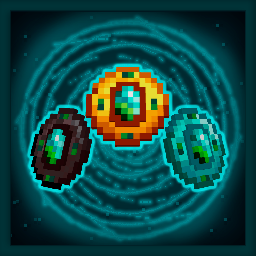

# Stasis Paradox

<p align="center">
  
</p>

<p align="center">
  A Fabric mod for Minecraft 1.21.1 centered around a controllable time-stop artifact called the <strong>Paradox</strong>.
</p>

## Overview

Stasis Paradox adds a staged time stop system to Minecraft, built around a single artifact that can be charged, upgraded, and tuned for different lapse lengths.

The mod focuses on freezing everything on the world, entities, sounds, movement, etc, and give the player who activates it the capability to interact with anything while the time is stopped.

## Features

- Trigger a full Stasis event with the `Paradox`.
- Freeze entities, projectiles, block entities, scheduled world logic, random ticks, time progression, and weather.
- Apply transition-based visuals instead of an instant hard cut.
- Add grayscale post-processing, looping Stasis audio, and afterimage/player trail effects during the freeze.
- Upgrade the Paradox through three visual and gameplay tiers: `Dawn`, `Astral`, and `Void`.
- Choose different lapse lengths through an in-game Paradox interface.
- Emergency-break an active Stasis event with `/stasis break`.

## How To Use

- Right-click with the `Paradox` to activate Stasis.
- Sneak + right-click with the `Paradox` to open its control interface.
- Load the item with `Temporal Grit` to give it uses.
- Upgrade the item inside the Paradox interface with the proper materials.

### Paradox tiers

- `Dawn` is the base tier. It supports `10s` lapses and up to `4` grit charges.
- `Astral` unlocks `20s` lapses and raises capacity to `12` grit charges.
- `Void` unlocks `30s` lapses and custom lapse times from `00:01` to `59:59`, with up to `40` grit charges.

### Controls

- `Right-click`: activate the currently selected lapse.
- `Sneak + right-click`: open the Paradox screen.
- `/stasis break`: force-end an active Stasis event.

Only the activating player or an operator can break an active Stasis event with the command.

## Progression And Crafting

### Core items

- `Temporal Grit`: crafted from `Ender Eye + Ender Pearl`, yields `2`.
- `Stasis Core`: crafted from `4 Temporal Grit + 1 Diamond`.
- `Paradox`: crafted from `4 Gold Ingots + 4 Temporal Grit + 1 Stasis Core`.

### Upgrade materials

- `Reinforced Diamond`: crafted from `Diamond + Echo Shard`.
- `Reinforced Netherite`: crafted from `Netherite Ingot + Echo Shard`.

### Upgrade path

- Insert `4 Reinforced Diamond` in the Paradox screen to upgrade `Dawn -> Astral`.
- Insert `4 Reinforced Netherite` in the Paradox screen to upgrade `Astral -> Void`.
- Add `Temporal Grit` to the dedicated slots in the interface to refill uses.

## Installation

- Minecraft `1.21.1`
- Fabric Loader `0.16.3+`
- Fabric API
- Java `21`

Drop the built mod jar into your `mods` folder together with Fabric API.

## Configuration

The mod creates a `config/stasis.properties` file on first run.

It includes timing-related settings for:

- chronometer uses
- transition-in duration
- active Stasis duration
- transition-out duration

## Building

```bash
./gradlew build
```

On Windows:

```powershell
.\gradlew.bat build
```

The built jar is generated in `build/libs/`.

## Repository Notes

- Main mod id: `stasis`
- Public-facing name: `Stasis Paradox`
- Built for Fabric on Minecraft `1.21.1`
